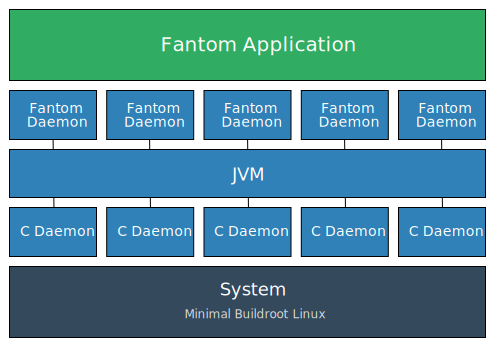

# About Studs

[fantom]: http://fantom.org

With the increasing availability of low-cost embedded platforms, such as the
Raspberry Pi and BeagleBone, there is a huge opportunity to bring embedded
development to a much larger community, both as a hobby and commercially. Studs
is an attempt to fill part of that void for developers who's background or
preference favors languages similar to [Fantom][fantom].

The goal for Studs is to abstract away the complexity of booting and
interfacing with hardware, and provide a turn-key framework for working with
embedded systems. This allows developers to focus on what matters -- the
application -- and avoid boiler plate like boot loaders, networking, serial
communication, and updating firmware.

From a developer's perspective, the worldview for a piece of hardware is
presented purely through a Fantom API. This keeps the abstractions high and the
interactions consistent. In most cases you never need to leave Fantom. However,
if a low level feature is required, Studs also includes easy to use
cross-compiler toolchains to easily compile and package C binaries into your
firmware.

## Architecture

Studs is composed of primarily 3 layers:

Looking at each section -- starting from the bottom up:

### System

[system]:  Systems.html
[br]:      https://buildroot.org
[faninit]: faninit.html
[daemons]: Daemons.html

Studs [systems][system] are simply minimal Linux images built using
[Buildroot][br]. They provide only the bare necessities for booting onto a
specific hardware platform.

Studs replaces the standard `/sbin/init` with a custom [faninit][faninit]
binary that boots directly into the JVM and starts the Fantom Application. By
skipping general initialization, and only bringing up the required sub-systems,
Studs applications can boot in seconds.

### Framework

The bulk of Studs lives at the Framework level. Here we provide a suite of
Fantom APIs to interact with the underlying hardware.

At boot time Studs will spawn a number of Fantom [daemons][daemons]. These are
background threads that manage system and hardware resources. In many cases
these daemons will interface with a corresponding native binary.

In general we eschew working with the standard linux utilities (such as
`ifconfig` or `udhcpd`), in favor of using dedicated native daemons that
efficiently marshal messages to and from the JVM process and interact directly
with kernel. The standard utilities work great when scripting or manually
managing a system, but they tend to be brittle when tooled -- requiring lots of
assumptions for how they work and what to expect as output and error
conditions. By using custom binaries we can reduce unnecessary code and
simplify integration, which results in a more robust system.

### Application

Everything up until this point is included "out-of-the-box". The last piece --
the application -- is where developers start. A simple "Hello World"
application can be created, compiled, and loaded onto a hardware device in
only a few minutes.  This lets developers dive right into the most important
part of their product.

## Origin

[nerves]: http://nerves-project.org
[nerves_team]: https://github.com/orgs/nerves-project/people

Studs grew out of work on a commercial [Fantom][fantom]-based embedded system.
One of the key take aways from that project was a large percentage of the
effort involved in getting Fantom operating on, and interacting with, embedded
hardware was primarily general purpose (and boiler-plate).

Early in the original design of Studs, the [Nerves Project][nerves] began to
gain popularity. Nerves bears an uncanny similarity to what Studs was
attempting to achieve -- as well as including a number of very useful design
decisions that had not been considered. The present Studs project is largely
based on the phenomenal work of the [Nerves team][nerves_team].
