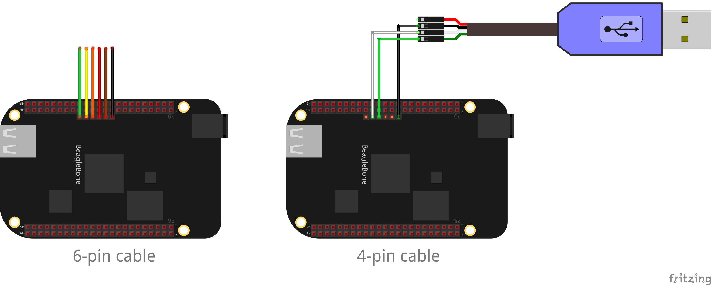
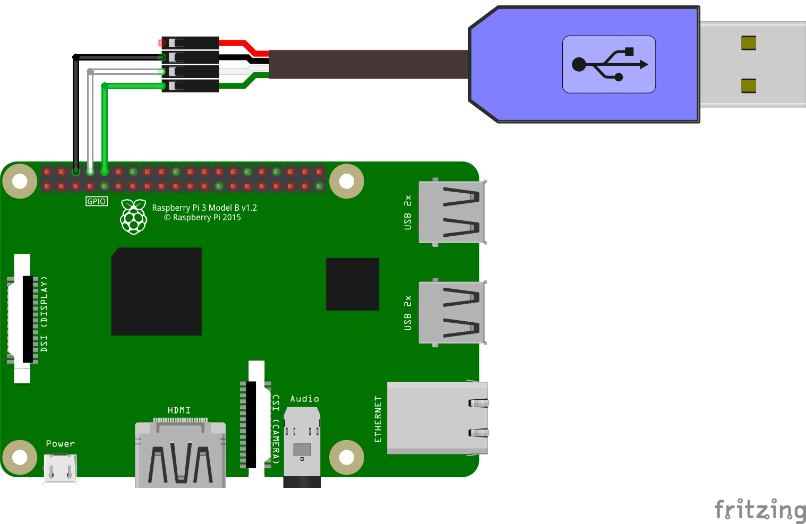

# Connecting PC to bbb/rpi3 serial console

How to connect your PC to the serial console on the BeagleBone Black or
Raspberry Pi 3. The serial console will allow you to view stdout as well as
access the Linux shell.

## USB-to-TTL serial cable

A 3.3V FTDI cable is needed to access the output. These cables are available
from:

**bbb -- 6pin FTDI cable:**

 * [Adafruit](https://www.adafruit.com/products/70)
 * [Sparkfun](https://www.sparkfun.com/products/9717)
 * [Digikey](http://www.digikey.com/product-detail/en/TTL-232R-3V3/768-1015-ND/1836393)

**rpi3 -- 4pin FTDI cable:**

 * [Adafruit](https://www.adafruit.com/product/954)

## Connecting to Device

The console is configured to output to `ttyS0` by default on both the bbb and
rpi3.

### bbb

UART `ttyS0` is accessible by the 6 pin header labeled J1 on the Beaglebone
Black. Pin 1 on the cable is the black wire and connects to pin 1 on the board,
the pin with the white dot next to it.

A 4-pin cable may also be used, with only the GND, RX, and TX header pins
connected.

### rpi3

On the Raspberry Pi 3, UART `ttyS0` is accessed via the GND, RXD, and TXD
header pins:

## Opening a serial session

On macOS and Linux you can use the `screen` command to open a serial session to
the BBB:

    $ screen /dev/tty.usbserial 115200

The actual device name `tty.usbserial` will vary. It will typically include
`usb` somewhere in the name. You can use tab completion to search for the
correct device. You can also `ls /dev` before and after inserting your USB
cable and see what new port shows up.

Power on your BBB and you should now be able to view the stdout as Linux boots
and your application is started.

To access the shell, make sure you configure `faninit.props` for `exit.action`
and `exit.run`:

    exit.action=hang
    exit.run=/bin/sh

With these settings, when your Fantom application exits, or you press `Ctrl+C`
from the console, you will exit to a Linux shell.